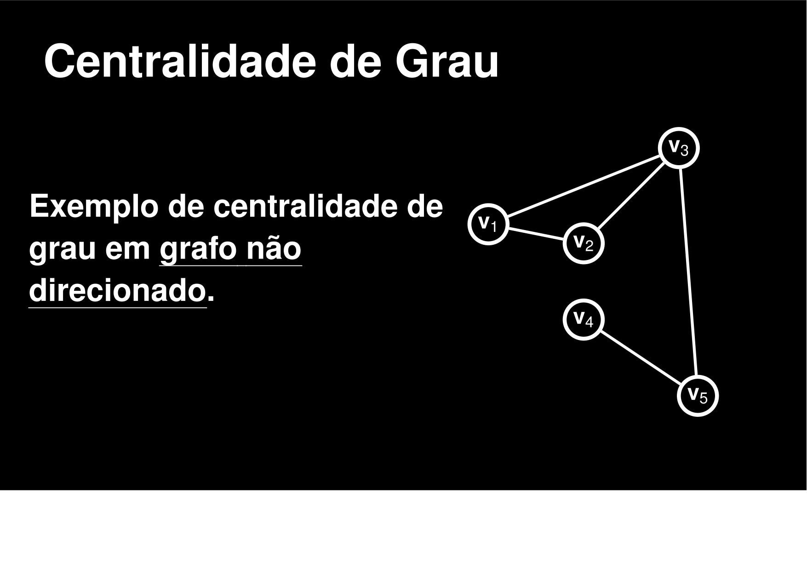

# ~FUNÇÕES IMPLEMENTADAS NO CÓDIGO~
### Breve descrição do que o código está realizando

* # CENTRALIDADE DE GRAU
#### Representação de uma Matriz de Centralização de Grau 

## --> Algoritmo implementado: 
        void centralidadeDeGrau(Grafo* g, double* valores) {
        if(g==NULL || valores ==NULL)return;
        int n = g->numVertices;
        if(n<=1){
        for(int v=0; v < n; v++){
            valores[v]= 0.0;
        }
        return;
        }
        for(int v = 0; v < n; v++){
        int grauEntrada = 0;
        for(int u = 0; u < n; u++){
            if(u != v && g->matriz[u][v]){
            grauEntrada++;
            }
        }
        valores[v] = (double)grauEntrada / (n-1);
        }
    }
* O código condigo conta cada vértice U que está apontando para v (que seria o grau de entrada)
* no grauEntrada, onde os v vai receber seu novo valor. Tentamos normalizar seu Valor de vértice para NO MÁXIMO (n-1). 

# ==============================================================================

* # CENTRALIDADE DE PROXIMIDADE 
#### Representação de uma Matriz de Centralização de Proximidade

## --> Algoritmo implementado: 
            void centralidadeDeProximidade(Grafo* g, double* valores) {
        int n = g->numVertices;
        int** dist =(int**)malloc(n*sizeof(int*));
        for(int i=0; i<n; i++){
        dist[i] = (int*)malloc(n * sizeof(int));
        }
        int** pred =(int**)malloc(n*sizeof(int*));
        for(int i=0; i<n; i++){
        dist[i] = (int*)malloc(n*sizeof(int*));
        }

        //TESTE DE CHAMADA DE DISTANCIA CALCULO FLOYD-WARSHALL
        calculaDistanciaFloydWarshall(g,  dist, pred);
        //para cada vertice
        for (int v = 0; v<n; v++){
        double somaDistancias = 0.0;
        int verticesAlcancaveis = 0;
        //distancia de v pa4ra todos os outros vertices
        for(int u = 0; u< n; u++){
            if(v != u && dist[v][u]< INFINITO){
            somaDistancias  += dist[v][u];
            verticesAlcancaveis++;
            }
        }

        if(verticesAlcancaveis > 0 && somaDistancias >0){
            valores[v] = (double)(verticesAlcancaveis)/ somaDistancias; 
        }else{
            valores[v] = 0.0;
        }
        }
        for(int i = 0; i<n; i++){
        free(dist[i]);
        free(pred[i]);
        }
        free(dist);
        free(pred);
        
    }

    
